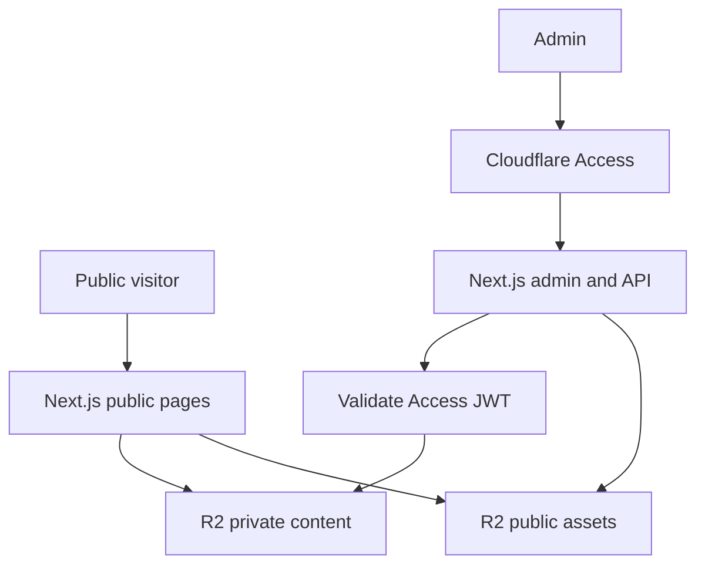

# Portflow Showcase: Architecture & Implementation Specification

| Thuộc tính | Giá trị |
| --- | --- |
| Repository | `weTwenties/portflow-showcase` |
| Phiên bản tài liệu | 3.0 |
| Trạng thái | Ready for implementation |
| Mô hình | Single portfolio, single admin, database-free |
| Runtime | Next.js trên Vercel |
| Storage | Cloudflare R2 |
| Authentication | Cloudflare Access |

## 1. Product brief

`portflow-showcase` là một website portfolio tối giản dành cho một designer hoặc một team nhỏ.

Website có ba surface chính:

- `/` hiển thị portfolio và danh sách project đã publish.
- `/{projectSlug}` hiển thị chi tiết một project.
- `/admin` là trang quản trị duy nhất để cập nhật portfolio và upload project.

Không có page builder, canvas, kéo thả, resize hoặc crop ảnh. Người quản trị chỉ nhập metadata, tạo project, upload ảnh, preview và publish.

Toàn bộ JSON và hình ảnh được lưu trên Cloudflare R2. V1 không sử dụng database, ORM hoặc CMS.

## 2. Scope V1

### 2.1 Có trong V1

- Một website portfolio.
- Một tài khoản admin duy nhất.
- Cloudflare Access bảo vệ `/admin` và toàn bộ write API.
- Chỉnh sửa thông tin portfolio bằng form.
- Tạo, sửa metadata và xóa project.
- Không cho hai project có tên trùng nhau.
- Project có slug duy nhất và URL `/{projectSlug}`.
- Upload nhiều ảnh trực tiếp lên R2 bằng presigned URL.
- Ảnh hiển thị đúng tỷ lệ gốc, không crop.
- Draft, preview và publish.
- Root page và project page public, không cần đăng nhập.
- Google Fonts qua `next/font/google`.

### 2.2 Không có trong V1

- Nhiều user hoặc nhiều role.
- Đăng ký tài khoản trong ứng dụng.
- Auth.js, password hoặc user table.
- Nhiều portfolio.
- Database.
- Drag-and-drop.
- Layout editor.
- Image editor.
- Rich text editor.
- Realtime collaboration.
- Comment, approval, billing hoặc analytics nâng cao.
- Custom domain do user tự cấu hình.
- Micro frontend runtime phức tạp hoặc Module Federation.

## 3. Các quyết định đã chốt

| Chủ đề | Quyết định |
| --- | --- |
| Public home | `/` |
| Public project | `/{projectSlug}` |
| Admin | `/admin` duy nhất |
| Admin API | `/api/admin/*` |
| Số admin | Một email duy nhất |
| Login | Cloudflare Access, OTP hoặc IdP |
| Authorization cuối | App xác minh Access JWT và `ADMIN_EMAIL` |
| Storage | Hai R2 bucket: private và public assets |
| Project uniqueness | Unique theo normalized name và slug |
| Image order | Theo thứ tự upload; không có reorder trong V1 |
| Image fit | `width: 100%`, `height: auto`, không crop |
| Save | Nút Save rõ ràng, không autosave |
| Publish | Immutable release, cập nhật pointer sau cùng |
| Package manager | pnpm |
| Code architecture | DDD-lite theo module |

## 4. Kiến trúc tổng quan



### 4.1 Thành phần

| Thành phần | Trách nhiệm |
| --- | --- |
| Next.js | Public renderer, admin UI, API routes và R2 orchestration |
| Cloudflare Access | Login screen, identity provider và policy allow đúng một email |
| App JWT verifier | Xác minh chữ ký, issuer, audience, expiry và admin email |
| R2 private bucket | Draft JSON, release JSON, index và staging uploads |
| R2 public bucket | Ảnh đã finalize |
| Vercel | Build, deploy, server runtime và preview |

Cloudflare Access là lớp đăng nhập. Next.js vẫn tự xác minh JWT ở origin để chặn request đi vòng qua Cloudflare.

## 5. Public routes

### 5.1 `/`

Root page hiển thị:

- Tên portfolio.
- Giới thiệu ngắn.
- Avatar hoặc logo tùy chọn.
- Social links tùy chọn.
- Danh sách project đã publish.
- Mỗi project có cover, title và summary.

Project card link trực tiếp đến `/{projectSlug}`.

### 5.2 `/{projectSlug}`

Project page hiển thị:

- Project title.
- Summary hoặc description dạng plain text.
- Cover hoặc ảnh đầu tiên.
- Danh sách ảnh theo thứ tự upload.
- Link quay lại `/`.

Static routes như `/admin`, `/api`, `/_next`, `/robots.txt`, `/sitemap.xml` không được xem là project slug.

### 5.3 Routing rule

Next.js static route `/admin` có độ ưu tiên cao hơn dynamic route `/[projectSlug]`. Dynamic page phải trả `notFound()` nếu project không tồn tại hoặc chưa publish.

## 6. Admin flow

`/admin` là một trang quản trị duy nhất. Không cần dashboard nhiều tầng.

### 6.1 Layout admin

Admin page có ba vùng:

1. **Site settings:** portfolio title, bio, avatar, font và social links.
2. **Projects:** danh sách project, nút tạo, sửa, xóa và publish.
3. **Status:** unsaved changes, last saved, current release và public link.

Project editor có thể mở bằng dialog, drawer hoặc query string như `/admin?project={projectId}` nhưng canonical route vẫn là `/admin`.

### 6.2 Lần truy cập `/admin`

1. Browser truy cập `/admin` qua domain được Cloudflare proxy.
2. Cloudflare Access kiểm tra Access session.
3. Nếu chưa đăng nhập, Cloudflare hiển thị login.
4. User đăng nhập bằng OTP hoặc IdP đã cấu hình.
5. Access policy chỉ allow đúng `ADMIN_EMAIL`.
6. Email khác bị Cloudflare từ chối.
7. Request hợp lệ được chuyển đến Vercel với `Cf-Access-Jwt-Assertion`.
8. Next.js xác minh JWT và email một lần nữa.
9. Chỉ sau khi hợp lệ mới đọc draft admin từ R2.

Người biết URL `/admin` nhưng không có tài khoản được phép sẽ không vào được. Người cố gọi thẳng write API cũng bị chặn bởi cùng kiểm tra JWT.

### 6.3 Create project

1. Admin bấm New project.
2. Form yêu cầu name, summary và cover tùy chọn.
3. Client normalize để preview slug.
4. Client gọi `POST /api/admin/projects`.
5. Server xác minh Access JWT.
6. Server normalize project name và slug.
7. Server đọc `content/projects/index.json`.
8. Server kiểm tra normalized name và slug chưa tồn tại.
9. Server tạo project document.
10. Server cập nhật project index.
11. API trả project mới.

### 6.4 Upload images

1. Admin chọn một hoặc nhiều file.
2. Browser kiểm tra type, size và dimension.
3. Browser tạo preview và checksum.
4. Upload queue chạy tối đa 3 file song song.
5. Browser gọi `/api/admin/uploads/warm-up`.
6. Server xác minh admin rồi trả presigned PUT URL ngắn hạn.
7. Browser upload trực tiếp vào R2 staging.
8. Browser gọi `/api/admin/uploads/complete`.
9. Server kiểm tra staging object và finalize sang public asset key.
10. Asset metadata được thêm vào project form.
11. Admin bấm Save để ghi project draft.

### 6.5 Save project

1. Client gửi toàn bộ project document cùng `revision` hiện tại.
2. Server xác minh admin.
3. Server validate payload bằng Zod.
4. Server kiểm tra project name và slug không trùng project khác.
5. Server kiểm tra asset key thuộc prefix cho phép.
6. Server so sánh revision.
7. Server ghi history snapshot.
8. Server ghi project draft với revision tăng 1.
9. Server cập nhật project index.
10. Server revalidate admin và preview cache.

### 6.6 Delete project

1. Admin nhập hoặc xác nhận project name trong confirm dialog.
2. Server xác minh admin.
3. Server gỡ project khỏi index.
4. Server chuyển project draft sang tombstone hoặc archive prefix.
5. Asset chưa được release nào tham chiếu được cleanup sau retention window.

V1 không xóa cứng project và asset trong cùng request để tránh mất dữ liệu ngoài ý muốn.

### 6.7 Publish

1. Admin bấm Publish.
2. Server xác minh admin và draft revision.
3. Server đọc site draft, project index và toàn bộ project draft active.
4. Server validate schema, unique name, unique slug và asset references.
5. Server tạo `releaseId`.
6. Server ghi snapshot bất biến vào release prefix.
7. Server ghi `content/current.json` sau cùng.
8. Server revalidate `/`, `/{projectSlug}`, sitemap và metadata.
9. API trả release ID và public URL.

Nếu publish lỗi trước bước 7, release cũ vẫn là release active.

## 7. Project uniqueness

Project không được trùng tên, kể cả khác chữ hoa, khoảng trắng thừa hoặc Unicode representation.

### 7.1 Normalized name

```ts
function normalizeProjectName(value: string): string {
  return value
    .normalize("NFKC")
    .trim()
    .replace(/\s+/g, " ")
    .toLocaleLowerCase("vi-VN");
}
```

Ví dụ sau được xem là trùng:

- `Brand Identity`
- ` brand   identity `
- `BRAND IDENTITY`

### 7.2 Slug

Slug được tạo từ name khi tạo project nhưng là field ổn định. Đổi display name không tự đổi slug để tránh làm hỏng URL đã chia sẻ.

Slug phải:

- Chỉ chứa `a-z`, `0-9` và `-`.
- Dài từ 2 đến 80 ký tự.
- Không bắt đầu hoặc kết thúc bằng `-`.
- Không trùng project khác.
- Không thuộc reserved slugs.

Reserved slugs tối thiểu:

```ts
const RESERVED_SLUGS = new Set([
  "admin",
  "api",
  "login",
  "logout",
  "preview",
  "robots.txt",
  "sitemap.xml",
  "favicon.ico",
  "_next",
]);
```

### 7.3 Index check

`projects/index.json` lưu cả `normalizedName` và `slug`. Create và update đều kiểm tra hai field này trước khi ghi.

Vì chỉ có một admin, revision check và Web Locks API là đủ cho V1. Nếu sau này có nhiều editor đồng thời, uniqueness phải chuyển sang database có unique constraint.

## 8. R2 storage model

Sử dụng hai bucket để public asset không làm lộ draft JSON.

```text
portflow-showcase-private/
  content/site/draft.json
  content/projects/index.json
  content/projects/{projectId}/draft.json
  content/history/site/{revision}.json
  content/history/projects/{projectId}/{revision}.json
  content/releases/{releaseId}/manifest.json
  content/releases/{releaseId}/site.json
  content/releases/{releaseId}/projects/{projectSlug}.json
  content/current.json
  uploads/staging/{uploadId}
  archive/projects/{projectId}/{timestamp}.json

portflow-showcase-public/
  assets/{assetId}/original.webp
```

### 8.1 Storage rules

- Private bucket không public.
- Public bucket chỉ chứa asset đã finalize.
- Không dùng filename gốc làm object key.
- JSON dùng `Content-Type: application/json; charset=utf-8`.
- Draft dùng `Cache-Control: no-store`.
- Release snapshot là bất biến.
- Public asset dùng `Cache-Control: public, max-age=31536000, immutable`.
- `content/current.json` chỉ được ghi sau khi release hoàn tất.
- Staging prefix có lifecycle rule tự xóa.

## 9. JSON schemas

Mọi document có `schemaVersion` và được parse bằng Zod khi đọc.

### 9.1 Site document

```ts
type SiteDocument = {
  schemaVersion: 1;
  title: string;
  bio: string;
  avatarAssetId?: string;
  font: "inter" | "manrope" | "space-grotesk";
  socialLinks: Array<{
    label: string;
    url: string;
  }>;
  revision: number;
  updatedAt: string;
};
```

### 9.2 Project index

```ts
type ProjectIndexDocument = {
  schemaVersion: 1;
  revision: number;
  projects: Array<{
    id: string;
    name: string;
    normalizedName: string;
    slug: string;
    summary: string;
    coverAssetId?: string;
    status: "draft" | "published" | "archived";
    createdAt: string;
    updatedAt: string;
  }>;
};
```

### 9.3 Project document

```ts
type ProjectDocument = {
  schemaVersion: 1;
  id: string;
  name: string;
  normalizedName: string;
  slug: string;
  summary: string;
  description: string;
  assets: Array<{
    id: string;
    key: string;
    url: string;
    width: number;
    height: number;
    contentType: "image/webp";
    size: number;
    checksum: string;
    alt: string;
    order: number;
  }>;
  revision: number;
  createdAt: string;
  updatedAt: string;
};
```

Không lưu presigned URL, Access JWT hoặc secret trong JSON.

## 10. Image behavior

- Browser preprocess ảnh sang WebP trước khi upload nếu browser hỗ trợ pipeline ổn định.
- Ảnh lưu width và height thật.
- Public renderer dùng `width: 100%` và `height: auto`.
- Không dùng `object-fit: cover` cho ảnh project.
- Không crop hoặc đặt fixed height.
- Wrapper có background trắng.
- Hero là ảnh đầu tiên.
- Các ảnh còn lại chia tuần tự thành row tối đa 3 cột desktop.
- Row height theo ảnh cao nhất; cột thấp hơn để lộ nền trắng bên dưới.
- Tablet tối đa 2 cột; mobile 1 cột.
- Thứ tự hiển thị là thứ tự upload.

```ts
function buildRows(assets: Asset[]): Asset[][] {
  const sorted = [...assets].sort((a, b) => a.order - b.order);
  const [, ...rest] = sorted;
  const rows: Asset[][] = [];

  for (let index = 0; index < rest.length; index += 3) {
    rows.push(rest.slice(index, index + 3));
  }

  return rows;
}
```

## 11. Cloudflare Access authentication

### 11.1 Có thể dùng account qua Cloudflare không?

Có. Cloudflare Access đứng trước `/admin` và cung cấp login bằng:

- One-time PIN gửi đến email được allow.
- Google, GitHub hoặc IdP khác nếu đã cấu hình trong Zero Trust.

Với một admin, lựa chọn đơn giản nhất là OTP và Access policy chỉ allow đúng email admin.

Không dùng rule “Allow everyone” hoặc chỉ allow phương thức OTP. Policy phải giới hạn bằng email cụ thể.

### 11.2 Hai lớp bảo vệ

**Lớp 1, Cloudflare edge:** Access application bảo vệ:

- `example.com/admin*`
- `example.com/api/admin*`

**Lớp 2, Next.js origin:** mọi admin page và write API xác minh:

- Header `Cf-Access-Jwt-Assertion` tồn tại.
- JWT signature hợp lệ với Cloudflare Access JWKS.
- `iss` khớp team domain.
- `aud` chứa một trong các application AUD tags được cho phép.
- Token chưa hết hạn.
- Claim `email` khớp chính xác `ADMIN_EMAIL` sau lowercase/trim.

Chỉ kiểm tra header tồn tại là không đủ vì request gọi thẳng origin có thể giả header.

### 11.3 Origin bypass

Domain `*.vercel.app` có thể đi thẳng đến origin và bỏ qua Cloudflare edge. App-level JWT validation phải từ chối mọi `/admin` và `/api/admin/*` request không có token hợp lệ.

Public pages vẫn truy cập được qua Vercel URL. Admin trên Preview chỉ hoạt động khi preview có Cloudflare Access domain hoặc cơ chế preview protection riêng.

### 11.4 Local development

Localhost không có Access JWT. Có thể dùng:

```dotenv
DEV_ADMIN_BYPASS=true
```

Quy tắc bắt buộc:

- Chỉ hoạt động khi `NODE_ENV === "development"`.
- Build phải fail nếu `DEV_ADMIN_BYPASS=true` trong Preview hoặc Production.
- Không commit bypass mặc định là `true`.
- API vẫn đi qua cùng `requireAdmin()` function.

### 11.5 JWT verification

Dùng `jose` và remote JWKS:

```text
https://{CF_ACCESS_TEAM_DOMAIN}/cdn-cgi/access/certs
```

Tạo một `requireAdmin(request)` dùng chung cho admin Server Components và Route Handlers. Hàm trả verified admin identity hoặc throw typed unauthorized error.

## 12. Environment variables

Mọi credential và cấu hình riêng nằm trong env. User-generated content nằm trên R2, không nằm trong env.

```dotenv
# App
NEXT_PUBLIC_APP_URL=http://localhost:3000
APP_ENV=development

# Single admin
ADMIN_EMAIL=owner@example.com
CF_ACCESS_TEAM_DOMAIN=team-name.cloudflareaccess.com
CF_ACCESS_AUDS=
DEV_ADMIN_BYPASS=false

# Cloudflare R2
R2_ACCOUNT_ID=
R2_ACCESS_KEY_ID=
R2_SECRET_ACCESS_KEY=
R2_PRIVATE_BUCKET=portflow-showcase-private
R2_PUBLIC_BUCKET=portflow-showcase-public
R2_PUBLIC_BASE_URL=https://assets.example.com

# Upload finalization
UPLOAD_TOKEN_SECRET=
```

### 12.1 Env rules

- `.env` và `.env.local` không được commit.
- Repo có `.env.example` không chứa secret thật.
- Chỉ `NEXT_PUBLIC_*` được phép vào client bundle.
- R2 credential, Access config và upload secret nằm trong `server-only` module.
- Zod validate env khi build hoặc khởi động.
- `CF_ACCESS_AUDS` được parse thành `Set<string>` từ danh sách comma-separated và phải có ít nhất một giá trị.
- Development, Preview và Production có env riêng trên Vercel.
- R2 API token chỉ có quyền tối thiểu trên hai bucket của dự án.

## 13. Upload protocol

### 13.1 Warm-up

`POST /api/admin/uploads/warm-up`

```json
{
  "fileName": "project-cover.png",
  "contentType": "image/webp",
  "size": 812312,
  "checksum": "base64-sha256",
  "width": 1600,
  "height": 2200
}
```

Server:

1. Gọi `requireAdmin()`.
2. Validate type, size và dimensions.
3. Tạo `uploadId` và staging key.
4. Tạo presigned PUT URL hết hạn sau 60 đến 90 giây.
5. Ký finalize token chứa upload ID, staging key, checksum, size và expiry.

### 13.2 Complete

`POST /api/admin/uploads/complete`

```json
{
  "uploadId": "upload_...",
  "finalizeToken": "signed-token"
}
```

Server:

1. Gọi `requireAdmin()`.
2. Xác minh chữ ký và expiry của finalize token.
3. Dùng `HeadObject` kiểm tra staging object.
4. So sánh size, MIME type và checksum.
5. Copy sang immutable public key.
6. Xóa staging object.
7. Trả asset metadata.

Complete phải idempotent theo `uploadId`. Retry sau khi finalize trả cùng asset metadata.

Presigned URL có thể bị replay trước expiry. Staging key, token finalize và immutable final key tạo single-turn semantics ở tầng ứng dụng.

## 14. API surface

Không cần public content API trong V1. Public Server Components đọc release JSON trực tiếp từ R2.

| Method | Endpoint | Chức năng |
| --- | --- | --- |
| `GET` | `/api/admin/content` | Đọc site draft, project index và status |
| `PUT` | `/api/admin/site` | Lưu site settings |
| `POST` | `/api/admin/projects` | Tạo project, check unique name và slug |
| `PUT` | `/api/admin/projects/{projectId}` | Lưu project, check revision và uniqueness |
| `DELETE` | `/api/admin/projects/{projectId}` | Archive project |
| `POST` | `/api/admin/uploads/warm-up` | Tạo presigned upload |
| `POST` | `/api/admin/uploads/complete` | Verify và finalize asset |
| `POST` | `/api/admin/publish` | Tạo release mới |

Mọi endpoint trong bảng đều bắt buộc `requireAdmin()` trước khi đọc body hoặc truy cập R2.

### 14.1 Error contract

```ts
type ApiError = {
  error: {
    code: string;
    message: string;
    requestId: string;
    details?: Record<string, unknown>;
  };
};
```

| Trường hợp | HTTP | Code |
| --- | --- | --- |
| Thiếu hoặc sai Access JWT | 401 | `UNAUTHENTICATED` |
| Email không phải admin | 403 | `FORBIDDEN` |
| Payload sai | 400 | `VALIDATION_ERROR` |
| Project không tồn tại | 404 | `PROJECT_NOT_FOUND` |
| Trùng tên | 409 | `PROJECT_NAME_CONFLICT` |
| Trùng slug | 409 | `PROJECT_SLUG_CONFLICT` |
| Revision cũ | 409 | `REVISION_CONFLICT` |
| Upload hết hạn | 410 | `UPLOAD_EXPIRED` |
| Asset không hợp lệ | 422 | `INVALID_ASSET` |
| R2 tạm lỗi | 503 | `STORAGE_UNAVAILABLE` |

Không trả stack trace, R2 private key, signed URL cũ hoặc provider error trực tiếp cho client.

## 15. State management

R2 document là nguồn sự thật. Zustand chỉ quản lý client state dùng chung.

### 15.1 Zustand stores

- `upload-store`: queue, progress, retry và local preview.
- `admin-ui-store`: selected project, dialog state và unsaved indicator nếu cần chia sẻ.

Không đưa toàn bộ site/project server data vào global store nếu form state cục bộ là đủ.

```ts
type UploadStatus =
  | "queued"
  | "preprocessing"
  | "warming-up"
  | "uploading"
  | "finalizing"
  | "completed"
  | "failed"
  | "cancelled";
```

Zustand bật `devtools` trong development. Action có tên như `upload/enqueue`, `upload/complete`. Không persist signed URL, JWT hoặc secret.

## 16. Source structure

```text
src/
  app/
    layout.tsx
    page.tsx
    [projectSlug]/page.tsx
    admin/page.tsx
    api/admin/
      content/route.ts
      site/route.ts
      projects/route.ts
      projects/[projectId]/route.ts
      uploads/warm-up/route.ts
      uploads/complete/route.ts
      publish/route.ts
    error.tsx
    not-found.tsx
    robots.ts
    sitemap.ts
  modules/
    site/
      domain/
      application/
      infrastructure/
      presentation/
    project/
      domain/
      application/
      infrastructure/
      presentation/
    asset/
      domain/
      application/
      infrastructure/
      presentation/
    publishing/
      domain/
      application/
      infrastructure/
    access/
      application/require-admin.ts
      infrastructure/cloudflare-access-verifier.ts
  components/
    ui/
    layout/
    feedback/
  stores/
    upload-store.ts
    admin-ui-store.ts
  lib/
    api/
    env/
    ids/
    r2/
    validation/
    observability/
  test/
    fakes/
    fixtures/
    setup.ts
```

Chỉ tạo file khi có code sử dụng. Không sinh một cây folder rỗng chỉ để trông giống DDD.

## 17. Coding standards

### 17.1 Components

- Component có một trách nhiệm rõ ràng.
- Component dùng chung nằm trong `components`.
- Component theo domain nằm trong `modules/*/presentation`.
- Ưu tiên composition thay vì nhiều boolean props.
- Server Component là mặc định.
- Chỉ thêm `"use client"` khi cần state, effect hoặc browser API.
- Không fetch dữ liệu public ở client nếu Server Component làm được.

### 17.2 API

- Route Handler chỉ parse HTTP, gọi use case và map response.
- Business logic nằm trong application/domain layer.
- Mọi input ngoài hệ thống được parse bằng Zod.
- `requireAdmin()` là dòng đầu tiên của write API.
- Không import AWS SDK vào domain.

### 17.3 DDD-lite

- Domain chứa entity, value object, invariant và typed error.
- Application chứa use case và port.
- Infrastructure chứa R2 và Cloudflare adapters.
- Presentation chứa React components và hooks.
- Module chỉ import public contract của module khác.
- Không tạo generic repository hoặc base class khi chỉ có một implementation.

### 17.4 TypeScript

- Bật `strict`.
- Bật `noUncheckedIndexedAccess`.
- Bật `exactOptionalPropertyTypes` nếu dependency tương thích.
- Không dùng `any`; dùng `unknown` rồi validate.
- ID dùng branded type hoặc parser rõ ràng.
- Boolean dùng `is`, `has`, `can` hoặc `should`.
- Tránh global barrel file gây circular dependency.

### 17.5 Logging

- Mỗi mutation có `requestId`.
- Server log JSON có level, request ID, operation và duration.
- Không log JWT, R2 secret, presigned URL, OTP hoặc full email nếu không cần.
- Theo dõi upload failure, publish failure và R2 latency.

## 18. Validation limits

| Field | Giới hạn |
| --- | --- |
| Site title | 1 đến 80 ký tự |
| Bio | Tối đa 1.000 ký tự |
| Project name | 1 đến 120 ký tự |
| Summary | Tối đa 300 ký tự |
| Description | Tối đa 5.000 ký tự, plain text |
| Alt text | Tối đa 300 ký tự |
| Project count | Tối đa 100 |
| Asset/project | Tối đa 100 |
| File size | Tối đa 20 MiB trước preprocessing |
| Image dimension | Tối đa 12.000 px mỗi chiều |

Client validate để hỗ trợ UX. Server lặp lại mọi validation quan trọng.

## 19. Revision và consistency

Mỗi mutable document có `revision`.

Save flow:

1. Đọc document hiện tại.
2. So sánh `expectedRevision`.
3. Nếu khác, trả `409 REVISION_CONFLICT`.
4. Ghi history snapshot.
5. Ghi document mới với revision tăng 1.

Admin UI dùng Web Locks API theo resource ID để giảm save đồng thời giữa nhiều tab.

R2 không thay thế transaction database. Với một admin, rủi ro race nhỏ và chấp nhận được. Nếu có nhiều admin hoặc concurrent editor, phải chuyển project index và uniqueness sang database.

## 20. Caching và rendering

- `/` và `/{projectSlug}` đọc release active, không đọc draft.
- Admin và preview dùng `no-store`.
- Public release có thể cache theo release ID vì bất biến.
- Sau publish, gọi `revalidatePath("/")` và các project path liên quan.
- Project cũ bị đổi slug hoặc archive phải revalidate path cũ.
- Public page có canonical URL, Open Graph metadata và sitemap.
- Draft hoặc `/admin` có `noindex`.

## 21. Security checklist

- Cloudflare Access allow đúng một email.
- Access bảo vệ cả admin page và admin API.
- App xác minh JWT signature, issuer, audience, expiry và email.
- Origin Vercel không tin header chưa verify.
- `DEV_ADMIN_BYPASS` chỉ dùng local development.
- R2 private bucket không public.
- R2 credential chỉ nằm ở server.
- Presigned URL ngắn hạn và chỉ ghi đúng staging key.
- Finalize token gắn với checksum, size và expiry.
- Filename được sanitize và không dùng làm object key.
- User text được escape; không render HTML tùy ý.
- Asset URL phải thuộc `R2_PUBLIC_BASE_URL`.
- Security headers và CSP được cấu hình.
- Rate limit warm-up, complete, save và publish.
- Delete dùng archive trước, cleanup sau.

## 22. Test plan

### 22.1 Unit tests

- Normalize project name.
- Duplicate name khác case và whitespace.
- Slug generation và reserved slug.
- R2 key builder chống path traversal.
- Zod schemas và schema version.
- Revision conflict.
- Build image rows với 0, 1, 2, 3, 4, 6 và 7 ảnh.
- Finalize token sign, verify và expiry.
- Access email comparison.

### 22.2 Application tests

- Request thiếu JWT bị từ chối trước khi đọc R2.
- JWT sai issuer hoặc audience bị từ chối.
- JWT email khác admin bị từ chối.
- Create project thành công.
- Create/update project trùng tên trả 409.
- Create/update project trùng slug trả 409.
- Save revision cũ trả 409.
- Warm-up từ chối file quá giới hạn.
- Complete từ chối checksum mismatch.
- Complete retry trả cùng asset.
- Publish lỗi không thay `current.json`.

### 22.3 Component tests

- Admin form hiển thị validation error.
- Upload queue hiển thị progress, retry và cancel.
- Unsaved changes warning hoạt động.
- Delete project cần confirm.
- Public project image có width, height và alt.

### 22.4 Playwright flows

1. Admin hợp lệ mở `/admin`, tạo project và upload ảnh.
2. Project trùng tên bị chặn.
3. Save, publish và mở project ở `/{slug}`.
4. Browser không có Access session không gọi được admin API.
5. Public visitor mở `/` và project không cần login.
6. Desktop hiển thị tối đa 3 cột; mobile một cột.
7. Ảnh không crop và không horizontal overflow.
8. Publish lỗi giữ public release trước đó.

E2E không dùng production bucket.

## 23. CI/CD

```json
{
  "scripts": {
    "dev": "next dev",
    "build": "next build",
    "start": "next start",
    "lint": "eslint .",
    "typecheck": "tsc --noEmit",
    "test": "vitest run",
    "test:watch": "vitest",
    "test:e2e": "playwright test",
    "check": "pnpm lint && pnpm typecheck && pnpm test && pnpm build"
  }
}
```

Mỗi pull request chạy lint, typecheck, unit test và production build. Preview dùng R2 bucket hoặc prefix riêng, không ghi production data.

Public repository bật branch protection, secret scanning và dependency alerts.

## 24. Implementation milestones

### Milestone 0: Foundation

- Khởi tạo Next.js App Router, TypeScript, `src/`, Tailwind và pnpm.
- Cấu hình ESLint, Prettier, Vitest và Playwright.
- Tạo env schema, `.env.example` và server-only guards.
- Tạo CI và base error/not-found pages.

Exit: lint, typecheck, unit test và build chạy xanh không cần secret thật.

### Milestone 1: Domain và R2

- Tạo site, project, asset và release schemas.
- Tạo normalized name, slug và reserved slug rules.
- Tạo R2 client, key builder và repositories.
- Tạo fake repositories cho test.
- Tạo initial documents khi bucket chưa có dữ liệu.

Exit: project uniqueness và repository contract tests chạy xanh.

### Milestone 2: Cloudflare Access

- Implement Access JWT verifier bằng `jose`.
- Implement `requireAdmin()`.
- Bảo vệ `/admin` và `/api/admin/*` tại application layer.
- Implement local development bypass có guard.
- Viết auth unit/application tests.

Exit: request giả header hoặc gọi thẳng Vercel origin không ghi được R2.

### Milestone 3: Admin content

- Xây `/admin` single-page UI.
- Implement site settings.
- Implement project create/update/archive.
- Implement unique name/slug conflict UI.
- Implement revision conflict và unsaved warning.

Exit: admin quản lý được site/project metadata chỉ trên R2.

### Milestone 4: Upload

- Implement warm-up, complete và finalize token.
- Implement client preprocessing và checksum.
- Implement Zustand upload queue concurrency 3.
- Implement progress, retry, cancel và asset preview.

Exit: upload trực tiếp vào R2, complete idempotent, không lộ credential.

### Milestone 5: Public renderer

- Xây `/` và `/[projectSlug]`.
- Implement image layout đúng tỷ lệ.
- Implement Google Font mapping tĩnh.
- Thêm metadata, Open Graph, sitemap và robots.

Exit: public pages hoạt động không cần session trên desktop và mobile.

### Milestone 6: Publish

- Implement immutable release và `current.json` pointer.
- Implement preview draft trong `/admin`.
- Implement cache revalidation.
- Test publish failure và rollback behavior.

Exit: release lỗi không phá site đang public.

### Milestone 7: Hardening và deploy

- Cấu hình rate limit, CSP, logging và retention.
- Hoàn thiện Playwright critical flows.
- Cấu hình R2 CORS, lifecycle và custom asset domain.
- Cấu hình Cloudflare Access policy và Vercel environments.
- Viết README setup/deploy/troubleshooting.

Exit: Definition of Done V1 đạt đầy đủ.

## 25. Definition of Done V1

- `/` hiển thị portfolio đã publish.
- `/{projectSlug}` hiển thị đúng project đã publish.
- `/admin` không thể truy cập nếu không phải admin email.
- Gọi thẳng `/api/admin/*` hoặc Vercel origin không bypass được auth.
- Chỉ một admin email được phép.
- Không tồn tại user table hoặc database.
- Project không trùng normalized name hoặc slug.
- Toàn bộ JSON và ảnh nằm trên R2.
- R2 credential chỉ tồn tại ở server env.
- Upload dùng presigned URL, staging và finalize.
- Public image giữ tỷ lệ gốc và không crop.
- Admin state có thể inspect bằng Zustand devtools.
- Publish tạo release bất biến.
- Public site vẫn hoạt động nếu lần publish mới lỗi.
- Preview và Production không dùng chung writable data.
- Lint, typecheck, test, build và critical E2E chạy xanh.

## 26. Những điều coding agent không được tự thêm

- Database, ORM hoặc hosted CMS.
- Auth.js, password login hoặc user management.
- Multi-user hoặc team permissions.
- Drag-and-drop hoặc visual editor.
- Monorepo.
- Queue service riêng.
- Client-side R2 credential.
- HTML tùy ý trong project description.
- Custom domain management cho user.
- Abstraction hoặc dependency không có use case thực tế.

## 27. Infrastructure checklist

### 27.1 Cloudflare Access

- Tạo Zero Trust organization.
- Thêm OTP hoặc IdP mong muốn.
- Tạo self-hosted Access application cho `/admin*`.
- Tạo Access application/policy tương ứng cho `/api/admin*`.
- Hai application có thể dùng chung policy nhưng có Audience tag riêng.
- Allow đúng email admin, không allow mọi OTP user.
- Lấy cả hai Application Audience tags, lưu dạng comma-separated trong `CF_ACCESS_AUDS`.
- Kiểm tra login bằng admin email.
- Kiểm tra email khác bị từ chối.

### 27.2 R2

- Tạo private content bucket.
- Tạo public asset bucket.
- Tạo API token quyền tối thiểu.
- Gắn custom domain cho asset bucket.
- Cấu hình CORS cho upload origin.
- Cấu hình staging lifecycle cleanup.

### 27.3 Vercel

- Import public GitHub repository.
- Cấu hình env riêng cho Preview và Production.
- Không bật `DEV_ADMIN_BYPASS` ngoài local.
- Dùng bucket/prefix test cho Preview.
- Gắn production domain qua Cloudflare proxy.
- Kiểm tra Vercel URL trực tiếp không vào được admin/write API.

## 28. Prompt khởi động cho Claude Code

```text
Bạn đang triển khai public repository weTwenties/portflow-showcase.

Đọc toàn bộ ARD-portflow-showcase.md trước khi sửa code. Tài liệu này là nguồn
sự thật cho scope, routes, storage, authentication, API, coding standards,
milestones và Definition of Done.

Sản phẩm chỉ có:
- `/` là public portfolio.
- `/{projectSlug}` là public project.
- `/admin` là trang quản trị cho đúng một admin.
- `/api/admin/*` là write API được bảo vệ.
- Cloudflare Access login và application-level JWT verification.
- Cloudflare R2 lưu toàn bộ JSON và images.
- Không database, Auth.js, multi-user, DnD hoặc page editor.

Trong lượt đầu tiên chỉ thực hiện Milestone 0.

Trước khi sửa:
1. Kiểm tra repository và thay đổi hiện có.
2. Tóm tắt file sẽ tạo hoặc sửa.
3. Không ghi đè thay đổi không liên quan.

Trong khi làm:
- Dùng pnpm, Next.js App Router, TypeScript strict và `src/`.
- Secret/config nằm trong env; chỉ commit `.env.example` không có secret.
- Tạo component nhỏ và Route Handler mỏng.
- Dùng DDD-lite nhưng không tạo file/folder rỗng không được dùng.
- Không mở rộng ngoài milestone hiện tại.

Sau khi làm:
1. Chạy lint, typecheck, unit test và production build.
2. Sửa lỗi trong phạm vi thay đổi.
3. Báo cáo file chính, quyết định và kết quả verification.
4. Dừng để review trước Milestone 1.
```

## 29. Tài liệu tham khảo chính thức

- Cloudflare Access self-hosted applications: <https://developers.cloudflare.com/cloudflare-one/access-controls/applications/http-apps/self-hosted-public-app/>
- Cloudflare Access JWT validation: <https://developers.cloudflare.com/cloudflare-one/access-controls/applications/http-apps/authorization-cookie/validating-json/>
- Cloudflare Access application token: <https://developers.cloudflare.com/cloudflare-one/access-controls/applications/http-apps/authorization-cookie/application-token/>
- Cloudflare Access OTP: <https://developers.cloudflare.com/cloudflare-one/integrations/identity-providers/one-time-pin/>
- Cloudflare Access policies: <https://developers.cloudflare.com/cloudflare-one/access-controls/policies/>

---

Tài liệu này là nguồn sự thật cho V1. Scope cố ý nhỏ: một portfolio, một admin, hai public route patterns, một admin route và R2 làm storage. Mọi thay đổi sang multi-user, database hoặc editor phải có ADR mới trước khi implementation.